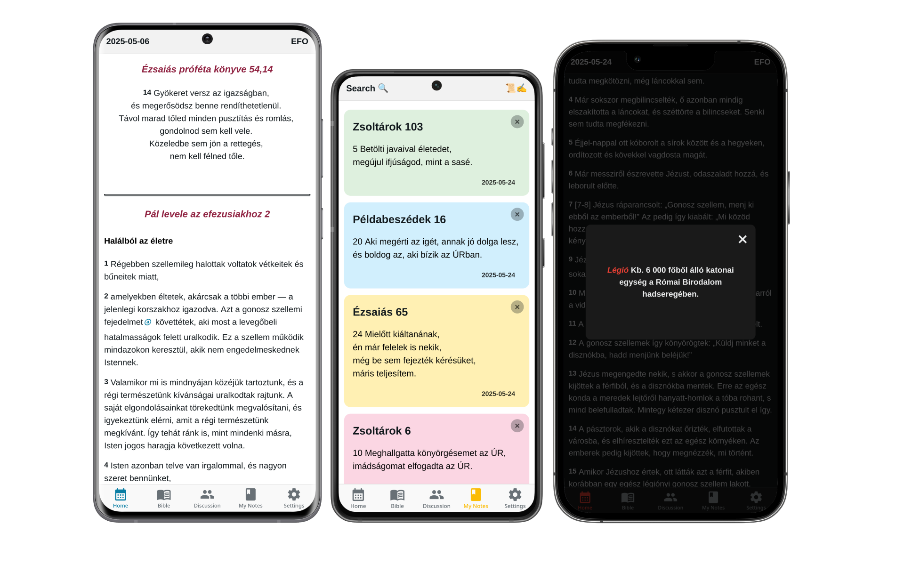
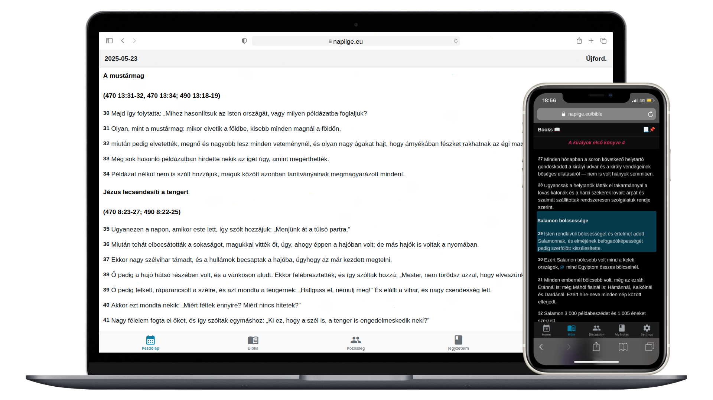

# 👋 Hi, I'm CarpetGlue

<strong>Junior Full-Stack Developer</strong> 
M.E.R.N.🍃 | L.A.M.P.💡| React Native ⚛️📱 + TypeScript 🟦 
I work with open-source tools on Arch Linux 🐧 
Passionate about UI/UX design ✨

 

# 🌐 Portfolio

 

# 🚀 Projects

### 📖 Napi Ige

Daily verse and Bible reader app written in React Native.  
Available on Android (iOS version ready to ship).

  

  <!---->
  <!---->

 

### Also available on web:

 

 

### About the project:  

 

# ☕ Support

**If you find my work useful:**  

  

